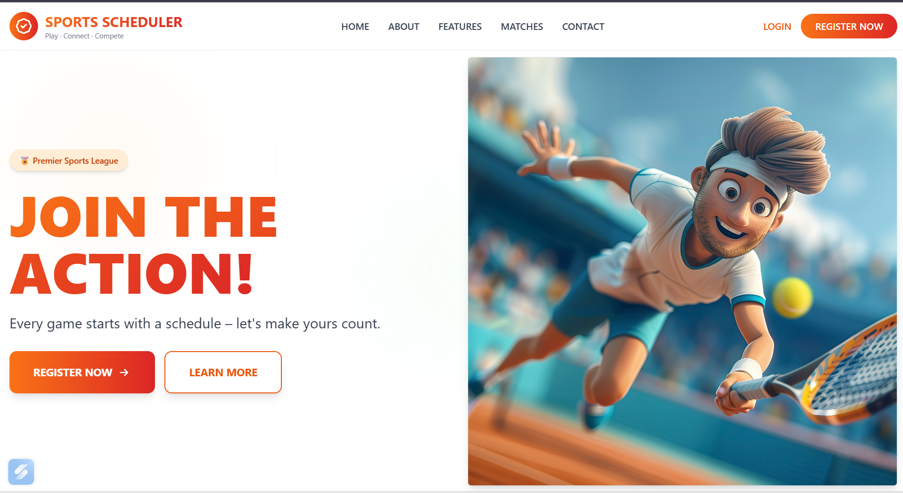
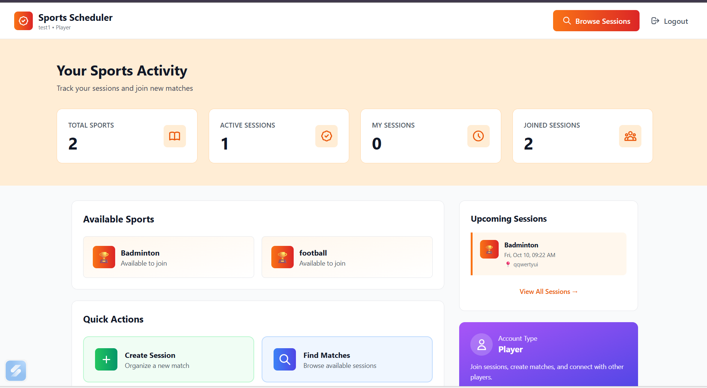
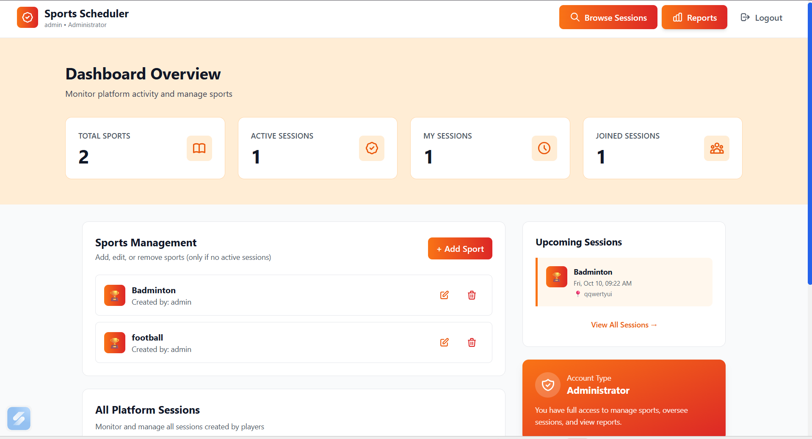

# 🏀 Sports Scheduler

A web application to organize and participate in sports sessions. Supports Admins for managing sports and viewing reports, and Players for creating and joining sessions.

---

## 🚀 Features

### 👤 Player

- Sign up / Sign in / Sign out
- Create new sport sessions (match with date, time, venue, teams, and required players)
- View and join available sessions
- Cancel their created sessions with reason

### 🧑‍💼 Admin

- Create and manage sports
- Create and join sessions like players
- View reports of sessions played in a time range
- Track popularity of different sports

---

## 🛠️ Tech Stack

**Frontend:** React.js, TailwindCSS  
**Backend:** Node.js, Express.js  
**Database:** PostgreSQL with Sequelize ORM  
**Authentication:** JWT-based login/signup

---

## 📂 Project Structure

```
sports-scheduler/
│── backend/
│   ├── models/        # Sequelize models
│   ├── routes/        # API routes
│   ├── middleware/    # Authentication middleware
│   ├── config/        # DB & JWT configs
│   └── server.js      # Express app entry
│
│── frontend/
│   ├── src/
│   │   ├── components/
│   │   ├── pages/
│   │   ├── context/   # Auth context
│   │   └── App.jsx
│   └── package.json
│
└── README.md
```

---

## ⚙️ Setup Instructions

### 1. Clone the repo

```bash
git clone https://github.com/sreepuli/sports-scheduler.git
cd sports-scheduler
```

### 2. Backend setup

```bash
cd backend
npm install
# Configure .env with database credentials
npm start
```

### 3. Frontend setup

```bash
cd frontend
npm install
npm run dev
```

---

## 📸 Screenshots

### 🔐 Landing Pages



### 🏆 Player Dashboard



### 📊 Admin Dashboard



---

## 🎥 Demo Video

👉 **Watch the demo on YouTube:** [Sports Scheduler Demo](https://youtu.be/YOUR_VIDEO_ID)

---

## 👥 Personas

**Admin** → Manages sports, views reports and analytics, monitors all platform sessions, and can also create/join sessions like a player.

**Player** → Creates and joins sessions, cancels their own sessions with reasons, participates in games, and manages their session participation.

---

## 📌 License

This project is for educational purposes.

---

**Built with ❤️ for sports enthusiasts!**
